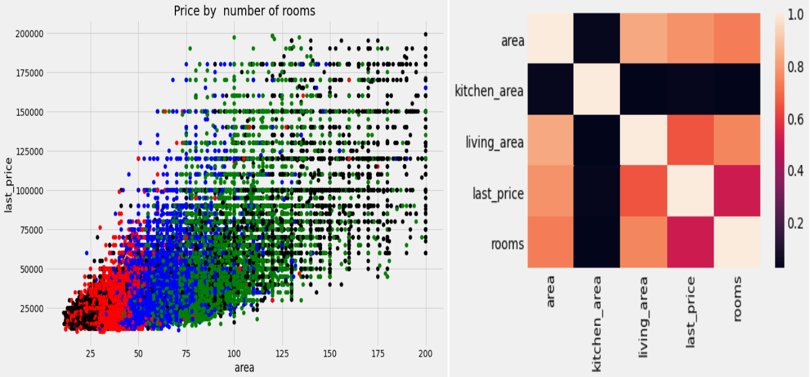
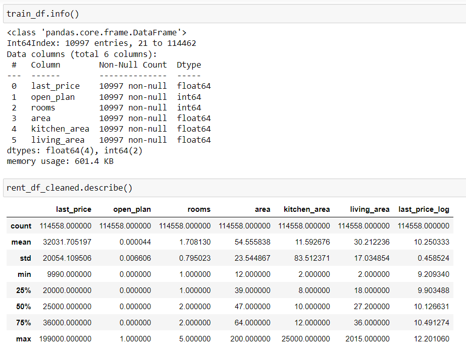

# Final Project of End-to-End Sample ML Project course 

*gsom_predictor*


## Information about the source data and some statistics


The data is coming from Yandex Real Estate's database, relating to Saint-Petersburg  real estate market. Mostly, the data consists of end prices, and a myriad of characteristcs, such as the address, date of sales, floor, area, and etc. of the property.

The data has been cleaned and pre-processed to get rid of empty cells.







## Information about the model


The models used here are a random forest and CatBoost.

The model 1 was made using a random forest with the parameters: open plan, rooms, area, kitchen_area, and living_area.

The model 2 was made using a catboosting with the parameter: open plan, rooms, area, kitchen_area, and living_area.

In both cases the MAE, MSE, and RMSE are reasonable enough to conclude that the models are not full of errors

| First model | Second model | type of estimation |
| :-----------: | :-----------: | :-----------: |
| 0.6658452304352385  | 0.7225863588521771  |  RMSE        |
| 0.44334987089335587       | 0.5221310459992473        |  MSE         |
| 0.3864934007165717       | 0.40888210752454973        |  MAE         |


## Instruction to install instructions and run the app with a virtual environment


- You need to create A Virtual Machine based on Ubuntu OS
- Install Python 3

```
     sudo apt install python3.8-venv
     
     python3 -m venv env
     
     source env/bin/activate

```

- Install libraries (Flask, Numpy, request, joblib, catboost etc.. check Requirements.txt)
- 
```
pip install -r requirements.txt.
```

- Initialise Git and pull files from the repository

```
    sudo apt install git
    
    git clone https://github.com/kapetandr/gsom_predictor.git
    
    cd gsom_predictor
```

- Run App.py (command python app.py)


- In [Postman] or another web service which you prefer crete GET request. Use IP address of your remote machine, then 5444 (port number) and name of the model 'predict_price'. The toute will look as follows:

[Postman]: https://web.postman.co/workspace/My-Workspace~29d1d2ae-6cef-4338-8634-60c41af19953/request/create?requestId=01196814-ccd5-45dd-a1b6-17cb6d25e864
```
    51.250.101.199:5444/predict_price?model=1&open_plan=1&rooms=5&area=98&kitchen_area=22&living_area=70
   
```
 Specify a list of parameters and their values. Click send and receive the result - price of apartment.

## How to run application using Docker


The Dockerfile is a text document containing all the commands to build the image. In my project Dockerfile contains the following commands:

    ```
    from ubuntu:20.04
    MAINTAINER Petr Kachanov
    RUN apt-get update -y
    COPY . /opt/gsom_predictor
    WORKDIR /opt/gsom_predictor
    RUN apt install -y python3-pip
    RUN pip3 install -r requirements.txt
    CMD python3 app.py
    ```
To run application with Docker, first, pull project
   
    ```
    docker pull kapetandr/gsom_predictor
    
    
    docker run --network host -d kapetandr/gsom_predictor
    ```


Additionally here is the [link](https://hub.docker.com/r/kapetandr/gsom_predictor) to Docker Hub 

